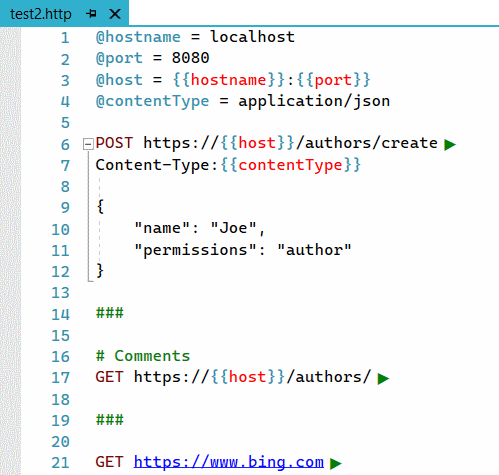

# Rest Client for Visual Studio

[](https://github.com/madskristensen/RestClientVS/actions/workflows/pr_build.yaml)
[](https://marketplace.visualstudio.com/items?itemName=MadsKristensen.RestClient)


REST Client allows you to send HTTP request and view the response in Visual Studio directly. Based on the popular VS Code extension [Rest Client](https://marketplace.visualstudio.com/items?itemName=humao.rest-client) by [Huachao Mao](https://github.com/Huachao)

## The .http file
Any files with the extension `.http` is the entry point to creating HTTP requests.

Here's an example of how to define the requests with variables and code comments.

```css
@hostname = localhost
@port = 8080
@host = {{hostname}}:{{port}}
@contentType = application/json

POST https://{{host}}/authors/create
Content-Type:{{contentType}}

{
    "name": "Joe",
    "permissions": "author"
}

###

# Comments
GET https://{{host}}/authors/

###

GET https://www.bing.com
```

This is what it looks like in the Blue Theme.



Notice the green play buttons showing up after each URL. Clicking those will fire off the request and display the raw response in the Output Widow.


Peek at the value of the variables by moving the mouse over any line containing a variable reference.


You can also right-click to find the Send Request command or use the **Ctrl+Alt+S** keyboard shortcut.


You can set the timeout of the HTTP requests from the *Options* dialog.

